# Xcode + Cargo

To demonstrate how to set up an Xcode + Cargo project, we'll create a new iOS application that makes use of `swift-bridge` in order
use `rust-analyzer` to perform syntax highlighting of Rust code.

When we're done we'll have a simple application where we can type Rust code into a text area and see the syntax
highlighted version below it.

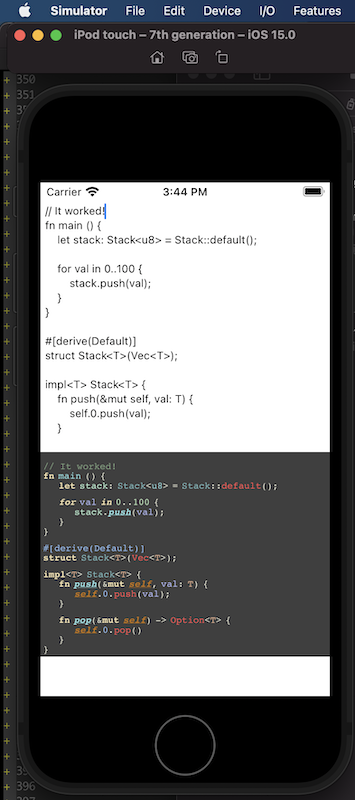

## Project Setup

Create a new project.

```sh
cargo new --lib ios-rust-analyzer
cd ios-rust-analyzer
```

---

Install [`cargo-lipo`](https://github.com/TimNN/cargo-lipo).

```
cargo install -f cargo-lipo
```

---

Create a new Xcode project within the `ios-rust-analyzer` directory.

`Xxode > File > New Project > iOS > App`

We'll name it `IosRustAnalyzer`.

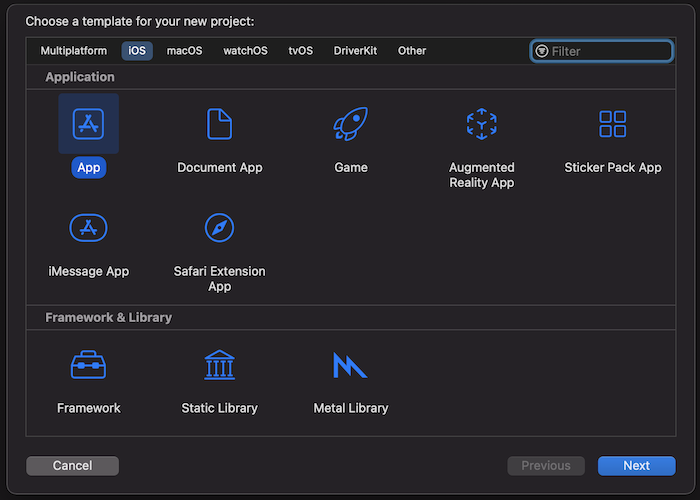

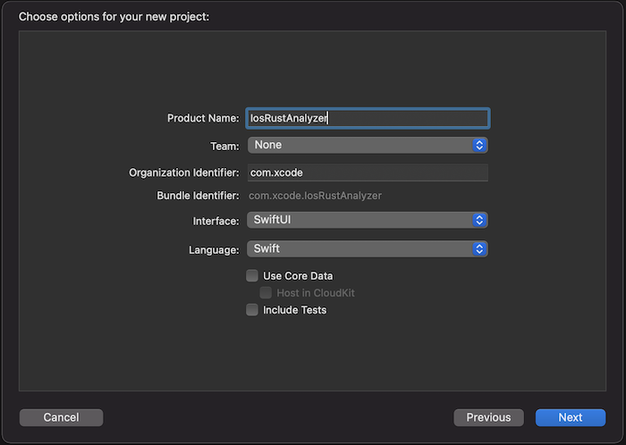

Your directory should now look something like:

```
$ tree -L 2
.
├── Cargo.toml
├── IosRustAnalyzer
│   ├── IosRustAnalyzer
│   └── IosRustAnalyzer.xcodeproj
└── src
    └── lib.rs
```

---

Create a bash script that we can use to build the application

```
touch IosRustAnalyzer/build-rust.sh
chmod +x IosRustAnalyzer/build-rust.sh
```

```sh
#!/bin/bash

##################################################
# We call this from an Xcode run script.
##################################################

set -e

if [[ -z "$PROJECT_DIR" ]]; then
    echo "Must provide PROJECT_DIR environment variable set to the Xcode project directory." 1>&2
    exit 1
fi

cd $PROJECT_DIR

export PATH="$HOME/.cargo/bin:$PATH"

export SWIFT_BRIDGE_OUT_DIR="${PROJECT_DIR}/Generated"

# Without this we can't compile on MacOS Big Sur
# https://github.com/TimNN/cargo-lipo/issues/41#issuecomment-774793892
if [[ -n "${DEVELOPER_SDK_DIR:-}" ]]; then
  export LIBRARY_PATH="${DEVELOPER_SDK_DIR}/MacOSX.sdk/usr/lib:${LIBRARY_PATH:-}"
fi

# if [ $ENABLE_PREVIEWS == "NO" ]; then

  if [[ $CONFIGURATION == "Release" ]]; then
      echo "BUIlDING FOR RELEASE"
      
      cargo lipo --release --manifest-path ../Cargo.toml
  else
      echo "BUIlDING FOR DEBUG"

      cargo lipo --manifest-path ../Cargo.toml
  fi
  
# else
#   echo "Skipping the script because of preview mode"
# fi
```

---

Create a new build phase that calls `./build-rust.sh` — the bash script that we created.

Be sure to drag it before the `Compile Sources` step.

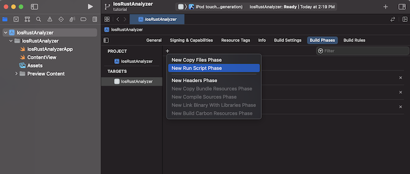

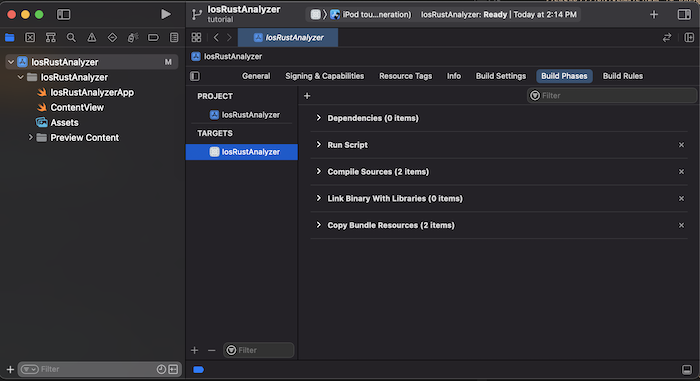


---

Create a directory `Generated` where our generated Swift and C code will go.

```
mkdir IosRustAnalyzer/Generated
touch IosRustAnalyzer/Generated/.gitignore
```

Give `IosRustAnalyzer/Generated/.gitignore` the following contents:

```
# IosRustAnalyzer/Generated/.gitignore
*
!.gitignore
```

---

Create a new bridging header and name it `BridgingHeader.h`.

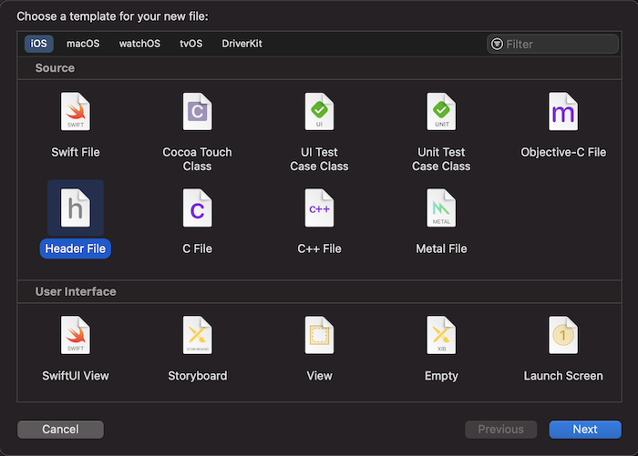

Give it these contents:

```c
#ifndef BridgingHeader_h
#define BridgingHeader_h

#include "Generated/SwiftBridgeCore.h"
#include "Generated/ios-rust-analyzer/ios-rust-analyzer.h"

#endif
```

---

Set the bridging header to `$(PROJECT_DIR)/BridgingHeader.h`

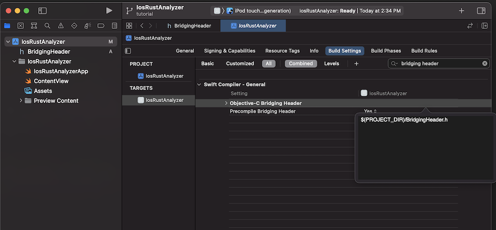

---

In the `Cargo.toml`, set the crate-type and build script.

```toml
[package]
name = "ios-rust-analyzer"
version = "0.1.0"
edition = "2021"

build = "build.rs"

[build-dependencies]
swift-bridge-build = "0.1"

[lib]
crate-type = ["staticlib"]

[dependencies]
swift-bridge = "0.1"
ide = {git = "https://github.com/rust-analyzer/rust-analyzer"}
```

---

Create our build script.

```
touch build.rs
```

```rust
// In build.rs

fn main() {
  // TODO...
}
```

---

Build the `Cargo` project once so that we can generate the files that we'll be linking to.

```
PROJECT_DIR="${PWD}/IosRustAnalyzer" ./IosRustAnalyzer/build-rust.sh
```

---

Set the `Debug` library search path to `$(PROJECT_DIR)/../target/universal/debug`, and the `Release` library
search path to `$(PROJECT_DIR)/../target/universal/release`

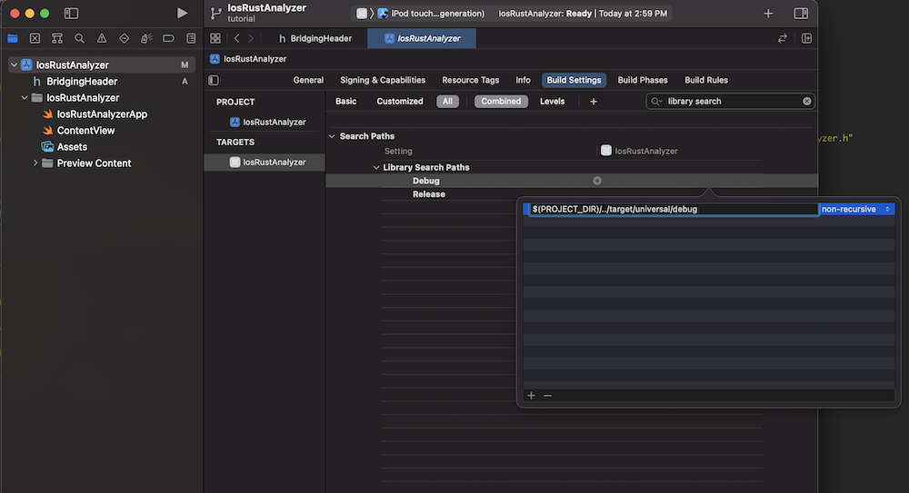

---

Go to `IosRustAnalyzer > General > Frameworks, Libraries, and Embedded Content > +` to add and click `Add Other > Add Files`.

Select the `target/universal/debug/libios_rust_analyzer.a` file.

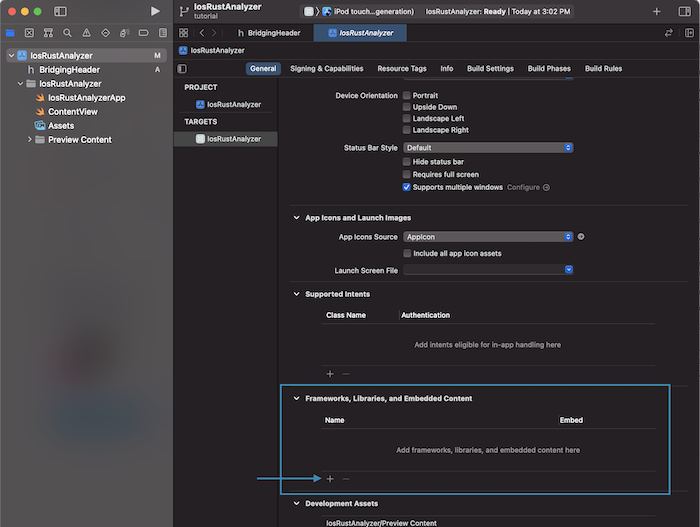

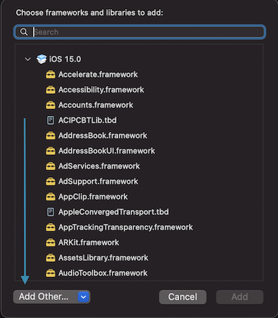

---

Select the same `target/universal/debug/libios_rust_analyzer.a` in the link binaries with libraries build phase.

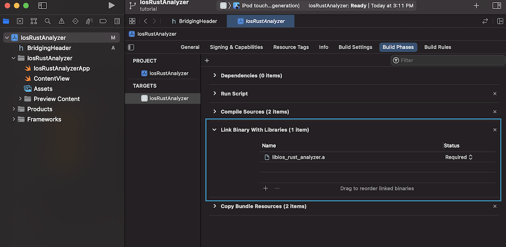

---

Add the following to the `build.rs` file that we created earlier.

```rust
const XCODE_CONFIGURATION_ENV: &'static str = "CONFIGURATION";

fn main() {
    let out_dir = "IosRustAnalyzer/Generated";

    let bridges = vec!["src/lib.rs"];
    for path in &bridges {
        println!("cargo:rerun-if-changed={}", path);
    }
    println!("cargo:rerun-if-env-changed={}", XCODE_CONFIGURATION_ENV);

    swift_bridge_build::parse_bridges(bridges)
        .write_all_concatenated(out_dir, env!("CARGO_PKG_NAME"));
}
```

---

Build again so that we can genrate the files that we're including from `BridgingHeader.h`.

```
PROJECT_DIR="${PWD}/IosRustAnalyzer" ./IosRustAnalyzer/build-rust.sh
```

---

Right click on `IosRustAnalyzer` and click `Add Files To IosRustAnalyzer`. Add the entire `Generated` directory.

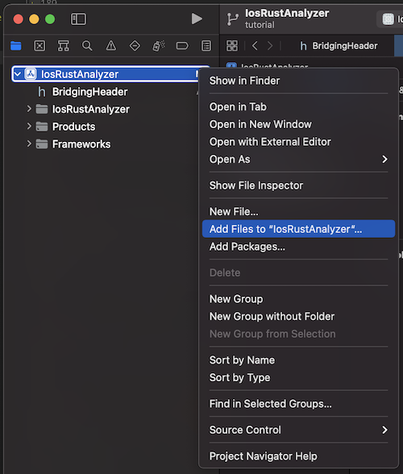

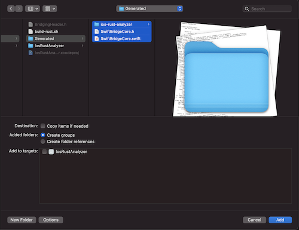

---

Pressing the `Run` button should now open up the iOS simulator with Xcode's default "Hello World" iOS app.

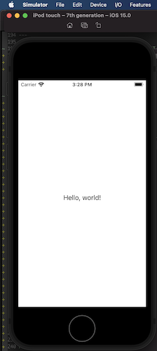


## Rust

Now that we've set up our project, it's time to write some code!

Add the following to `src/lib.rs`.

```rust
#[swift_bridge::bridge]
mod ffi {
    extern "Rust" {
        type RustApp;

        #[swift_bridge(init)]
        fn new() -> RustApp;

        fn generate_html(&self, rust_code: &str) -> String;
    }
}

pub struct RustApp {}

impl RustApp {
    fn new() -> Self {
        RustApp {}
    }

    fn generate_html(&self, rust_code: &str) -> String {
        let (analysis, file_id) = ide::Analysis::from_single_file(rust_code.to_string());

        analysis
            .highlight_as_html(file_id, true)
            .unwrap_or("Error".to_string())
    }
}
```

## Swift

Add the following to `IosRustAnalyzerApp.swift`

```swift
import SwiftUI

@main
struct IosRustAnalyzerApp: App {
    var body: some Scene {
        WindowGroup {
            ContentView()
                .environmentObject(RustAppWrapper(rust: RustApp()))
        }
    }
}

class RustAppWrapper: ObservableObject {
    var rust: RustApp
    
    init (rust: RustApp) {
        self.rust = rust
    }
}
```

---

Add the following to `ContentView.swift`

```swift
import SwiftUI
import WebKit
import Combine

struct ContentView: View {
    @EnvironmentObject var rustApp: RustAppWrapper
    
    @State private var rustSource = initialSource
    @State private var rustHtml = ""
    
    var body: some View {
        VStack {
            TextEditor(text: $rustSource)
                .font(.caption)
                .onReceive(Just(rustSource), perform: {sourceCode in
                    let html = rustApp.rust.generate_html(sourceCode).toString()
                    rustHtml = html
                })
            
            WebView(text: $rustHtml)
                .frame(minWidth: 0, maxWidth: .infinity, minHeight: 0, maxHeight: .infinity)
            
        }
    }
}

struct WebView: UIViewRepresentable {
    @Binding var text: String
    
    func makeUIView(context: Context) -> WKWebView {
        return WKWebView()
    }
    
    func updateUIView(_ uiView: WKWebView, context: Context) {
        uiView.loadHTMLString(text, baseURL: nil)
    }
}

let initialSource = """

fn main () {
    let stack: Stack<u8> = Stack::default();
    
    for val in 0..100 {
        stack.push(val);
    }
}

#[derive(Default)]
struct Stack<T>(Vec<T>);

impl<T> Stack<T> {
    fn push(&mut self, val: T) {
        self.0.push(val);
    }

    fn pop(&mut self) -> Option<T> {
        self.0.pop()
    }
}

"""
 

struct ContentView_Previews: PreviewProvider {
    static var previews: some View {
        ContentView()
            .environmentObject(RustAppWrapper(rust: RustApp()))
    }
}
```

---

Make sure that you see 4 files in your `Compile Sources` build phase.

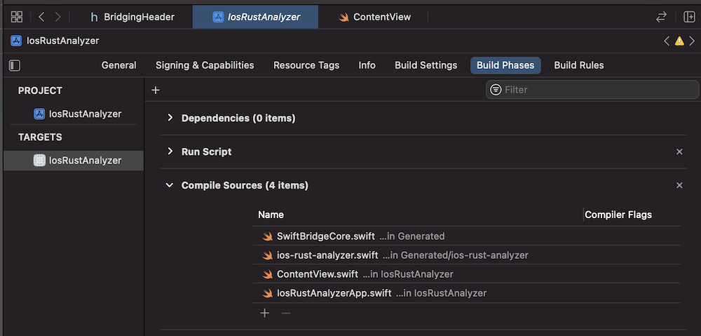

---

Runing the application in the iPhone simulator using `Cmd` + `R` should show a working demo!


