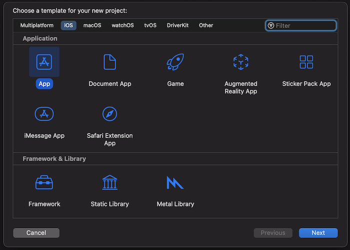
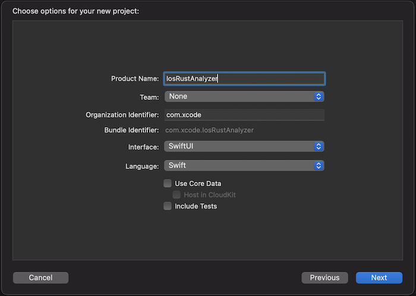

# Tutorial: Running rust-analyzer on an iPhone

In this chapter we'll create a new iOS application that makes use of `swift-bridge` in order
use `rust-analyzer` to perform syntax highlighting of Rust code.

## Project Setup

Create a new project.

```sh
cargo new --lib ios-rust-analyzer
cd ios-rust-analyzer
```

---

Install [`cargo-lipo`](https://github.com/TimNN/cargo-lipo).

```
cargo install -f cargo-lipo
```

---

In the `Cargo.toml`, set the crate-type and build script.

```toml
[package]
name = "ios-rust-analyzer"
version = "0.1.0"
edition = "2021"

build = "build.rs"

[build-dependencies]
swift-bridge-build = "0.1"

[lib]
crate-type = ["staticlib"]

[dependencies]
swift-bridge = "0.1"
ide = {git = "https://github.com/rust-analyzer/rust-analyzer"}
```

---

Create a new Xcode project within the `ios-rust-analyzer` directory.

`Xxode > File > New Project > iOS > App`

We'll name it `IosRustAnalyzer`.





Your directory should now look something like:

```
$ tree -L 2
.
├── Cargo.toml
├── IosRustAnalyzer
│   ├── IosRustAnalyzer
│   └── IosRustAnalyzer.xcodeproj
└── src
    └── lib.rs
```

---

Create a bash script that we can use to build the application

```
touch IosRustAnalyzer/build-rust.sh
chmod +x IosRustAnalyzer/build-rust.sh
```

```sh
#!/bin/bash

##################################################
# We call this from an Xcode run script.
##################################################

set -e

if [[ -z "$PROJECT_DIR" ]]; then
    echo "Must provide PROJECT_DIR environment variable set to the Xcode project directory." 1>&2
    exit 1
fi

export PATH="$HOME/.cargo/bin:$PATH"

export SWIFT_BRIDGE_OUT_DIR="${PROJECT_DIR}/Generated"

# Without this we can't compile on MacOS Big Sur
# https://github.com/TimNN/cargo-lipo/issues/41#issuecomment-774793892
if [[ -n "${DEVELOPER_SDK_DIR:-}" ]]; then
  export LIBRARY_PATH="${DEVELOPER_SDK_DIR}/MacOSX.sdk/usr/lib:${LIBRARY_PATH:-}"
fi

if [ $ENABLE_PREVIEWS == "NO" ]; then

  if [[ $CONFIGURATION == "Release" ]]; then
      echo "BUIlDING FOR RELEASE"
      
      cargo lipo --release --manifest-path ../Cargo.toml
  else
      echo "BUIlDING FOR DEBUG"

      cargo lipo --manifest-path ../Cargo.toml
  fi
  
# else
#   echo "Skipping the script because of preview mode"
# fi
```

---

Create a new build phase that calls the bash script. Be sure to drag it before the `Compile Sources` step.


---


---

Create a new bridging header

---

Set the bridging header

---

Edit the NAME_OF_SETTINGS_FILE to link to your Rust library

---

Edit the NAME_OF_SETTINGS_FILE to add a build phase that calls your run script.
