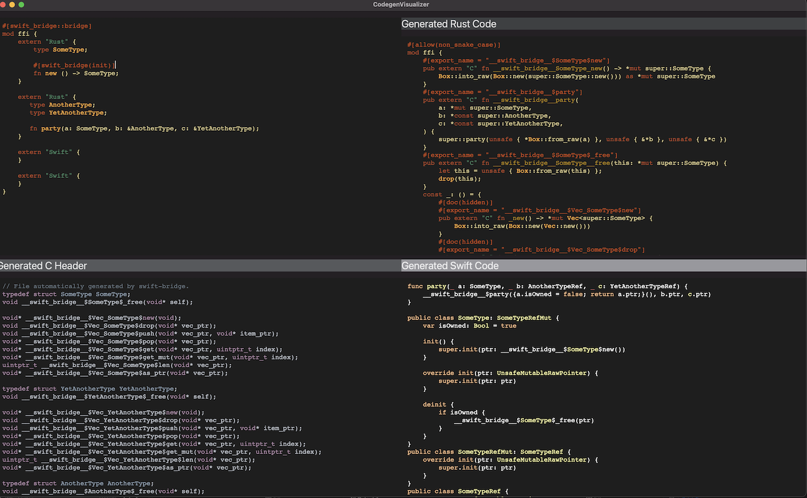

# Codegen Visualizer

This example uses `swift-bridge`'s module parser and code generator at runtime in order to show you the
Rust, Swift and C code that gets generates for a bridge module.

You can type in the top-left code editor and the `swift-bridge` generated code will appear in the other
three panes.

## To Run

```
open CodegenVisualizer/CodegenVisualizer.xcodeproj
# Click to "Run" button at the top left of Xcode
```

## Screenshots

#
